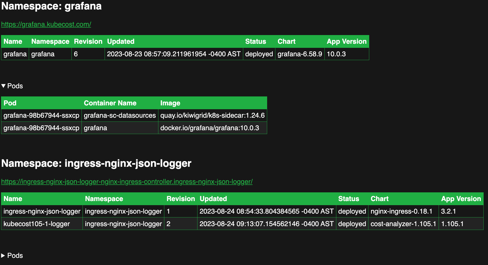

# kubernetes-web-environment-lister

Simple tool to find all the namespaces with ingresses and list the pods/containers/images.

Why was this made?

1. Easy to use: No need to type commands, just find the environment you need through a simple interface.
2. Read-only cluster-wide visibility.
3. Limited local namespace rights: to restart the web-server deployment.

TODO:

1. Watch ingresses and helm resources instead of a cronJob?
2. Multi-cluster
3. Search

Shout out to all the AI tools for writing a majority of this. The CSS was generated by copilot with the request for dark mode in the style of Kubecost.

Sample output:


## Security Considerations

This will expose every ingress in your cluster.  Please consider the security implications of this.

See the [oauth2 readme](auth/oauth2-proxy/README.md) as an example of how to secure this.

The service is exposed by an unprivileged (no service account and non-root) nginx web server.

The cronJob that creates the html configMap has a serviceAccount with cluster-wide privileges to read the required resources and `reload restart` the nginx deployment.

If you remove the helm list function, RBAC get secrets is not needed.

## Usage

Clone this repo:

```sh
git clone git@github.com:jessegoodier/kubernetes-environment-lister-web.git
```

Edit the manifests to fit your needs.
Then:

```sh
kubectl create ns environment-lister
kubectl create cm get-environments-script -n environment-lister --from-file get_environments.py
kubectl apply -f ./manifests -n environment-lister
```

Note that the nginx-web will have a status of `ContainerCreating` until the cronjob runs and creates the html configMap. This job runs every 13 minutes and can be configured in the [cronjob manifest](manifests/kubernetes-cronjob.yaml).

### One-off run/testing

A pod manifest is included for one-off runs of the python script. This is useful for debugging or if you don't want to wait for the cronjob to run.

```sh
kubectl create cm get_environments -n environment-lister --from-file get_environments.py
kubectl apply -f ./manifests/rbac.yaml -n environment-lister
kubectl apply -f ./testing-pod.yaml -n environment-lister
```
